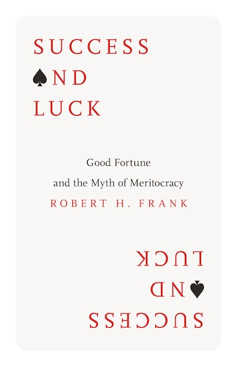

# Success and Luck: Good Fortune and the Myth of Meritocracy

재능과 노력이라는 요소는 정말 중요하다. 하지만 가장 커다란 보상을 차지하기 위한 사회적 경쟁이 너무나 격렬한 우리 시대에 재능과 노력만으로 승리를 보장할 수 있는 경우는 드물다. 오히려 거의 모든 경우에 상당한 행운이 필요하다.
한국어판 P.26

### 실험
* 0과 98 사이의 난수를 생성하여, 노력에 부여
* 0과 2 사이의 난수를 생성하여, 행운에 부여
* 가장 노력한 10명을 추리고 이들이 모두 승자가 되는지 확인

| Metric                        | Value 1 | Value 2 | Value 3 | Value 4 | Value 5 | Value 6 | Value 7 | Value 8 | Value 9 | Value 10 |
|-------------------------------|---------|---------|---------|---------|---------|---------|---------|---------|---------|----------|
| The Winners                   | 99.9    | 99.9    | 99.9    | 99.9    | 99.8    | 99.8    | 99.8    | 99.8    | 99.9    | 99.9     |
| The Efforts of the Winners    | 98.0    | 97.9    | 98.0    | 97.9    | 97.9    | 97.8    | 97.9    | 97.9    | 97.9    | 98.0     |
| The Lucks of the Winners      | 1.9     | 2.0     | 1.9     | 2.0     | 1.9     | 2.0     | 1.9     | 1.9     | 2.0     | 1.9      |
| The 10 Most Efforts           | 98.0    | 98.0    | 98.0    | 98.0    | 98.0    | 98.0    | 98.0    | 98.0    | 98.0    | 98.0     |

### 중간 해석

### 통계적 해석
